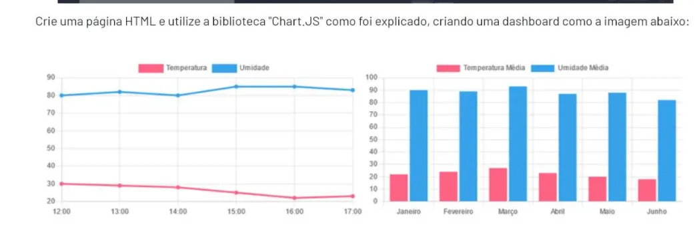

# 🌡️ Dashboard de Temperatura e Umidade

Este projeto é um **dashboard interativo** criado com **HTML**, **CSS** e a biblioteca **Chart.js**, com o objetivo de exibir dados ambientais de forma visual e simples.

## Sobre o Projeto

A dashboard apresenta dois gráficos principais:

- **Gráfico de Linha**: mostra a variação da temperatura e umidade ao longo de um dia (das 12h às 17h).
- **Gráfico de Barras**: exibe a média mensal de temperatura e umidade de janeiro a junho.

Tudo foi feito de forma leve e acessível, ideal para estudos e introdução à visualização de dados com Chart.js.

---

## 💻 Tecnologias Utilizadas

- HTML5
- CSS3
- JavaScript (Chart.js via CDN)

---

## Desafio

A imagem abaixo foi fornecida como referência visual e serviu como base para a construção do projeto::



---

## Como Usar

1. Clone o repositório:
   ```bash
   git clone https://github.com/ThaisKheyla/Dashboard_ChartJs.git
